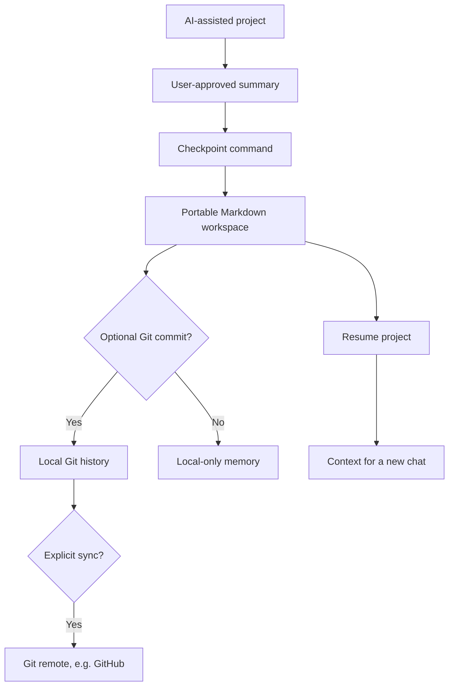

# ChatHandoffKit

**Persistent Project Memory for AI Conversations**

*Stop restarting your AI projects. Pick up where you left off.*

ChatHandoffKit is an **early-stage, local-first open-source CLI** for documenting, checkpointing, versioning, and resuming long-running AI-assisted projects. It saves portable Markdown files outside your chat history and can publish reviewed checkpoints through a **user-configured Git remote** (including GitHub).

> **Honest scope:** v0.2 introduces an optional Google Drive API adapter with desktop OAuth and explicit Markdown push/pull. Its Drive operations are tested against an offline fake API; **live Google OAuth/Drive acceptance is pending user setup**. It does **not** extract chat histories automatically, create GitHub repositories, guarantee full context recovery, or offer hosted AI memory.

## Why?

Long conversations can become difficult to navigate. A fresh AI chat may not have the decisions, architecture, solved bugs and next steps that shaped your work. ChatHandoffKit keeps an explicitly approved **project-memory layer** separate from any one model or conversation.

## Status

| Capability | Status | Notes |
|---|---|---|
| Markdown project scaffold | **Implemented, locally tested** | Seven standard project files |
| Manual checkpoint + dated session log | **Implemented, locally tested** | No automatic capture from ChatGPT |
| Current-state preservation | **Implemented, locally tested** | Only the marked managed section is rewritten |
| SHA-256 optimistic-state precondition | **Implemented, locally tested** | Optional guard, not a distributed lock |
| Context resume output | **Implemented, locally tested** | Reads selected Markdown files |
| Structure / basic secret checks | **Implemented, locally tested** | Heuristic only, not a security guarantee |
| Git commits + explicit push | **Implemented, tested against local bare Git remote** | Use your own configured GitHub remote and credentials |
| GitHub-specific API adapter | **Not implemented** | Standard Git transport is supported instead |
| Google Drive Markdown adapter | **Implemented; offline API tests passed; live OAuth pending** | Optional desktop OAuth, app-owned folders, explicit push/pull, optimistic hash baseline |
| Automated extraction of entire chats | **Not implemented** | Assistant/user must provide verified facts |
| MCP / visual UI / semantic search | **Planned** | Not advertised as working |

This repository is a **clean-room public implementation**, inspired by a real private project-memory workflow used across multiple AI-assisted projects. It does not contain the original private knowledge-base data.

## Quick start (Python 3.10+ and Git)

```bash
python -m venv .venv
# macOS/Linux: source .venv/bin/activate
# Windows PowerShell: .venv\Scripts\Activate.ps1
python -m pip install -e .

mkdir my-memory
chathandoff init --root my-memory --git
chathandoff create task-manager --title "Task Manager" --objective "Build a fictional task-management app" --root my-memory

chathandoff checkpoint task-manager --root my-memory \
  --state "Initial scope and architecture reviewed" \
  --next "Implement a fictional task API" \
  --decision "Use SQLite for the demo"

chathandoff validate --root my-memory
chathandoff resume task-manager --root my-memory
```

On Windows PowerShell, put the command on one line or use PowerShell backticks instead of Bash backslashes.

**Commit explicitly** by passing `--commit` to `create`/`checkpoint`. Create Git identity first (`git config user.name` / `user.email`). ChatHandoffKit stages only its specific changed files for its commits and refuses to commit when unrelated changes are already staged.

```bash
chathandoff checkpoint task-manager --root my-memory \
  --state "API works on synthetic fixtures" \
  --next "Add validation tests" --commit
```

`init --git` does **not** commit or push. If you choose to push to GitHub, first create an **empty repository** under your account and configure Git authentication yourself. Then, inside `my-memory`:

```bash
git remote add origin https://github.com/YOUR_ACCOUNT/YOUR_NEW_PRIVATE_REPO.git
# Make the initial commit if it does not exist yet (add only intended files).
git add -- START_HERE.md OPERATING_RULES.md PROJECTS_INDEX.md projects/task-manager/
git commit -m "docs(memory): initial project memory"
chathandoff sync --root . --remote origin --branch main --dry-run
chathandoff sync --root . --remote origin --branch main
```

If earlier commands already committed those files, you do not need a second initial commit. `sync` fetches first and refuses non-fast-forward/divergent remote history; it **never force-pushes**. Configure your own access and do not embed tokens in remote URLs or memory files.

See [GitHub setup](docs/github-setup.md) and the [offline demo](docs/workflow.md).

## Google Drive (v0.2 experimental)

Install optional dependencies and follow the [Drive setup and safety guide](docs/google-drive-setup.md).

```bash
python -m pip install -e '.[drive]'
# Enable Drive API in your own Google Cloud project; create an OAuth Desktop client.
# Download its client JSON OUTSIDE the repository (never commit it).
chathandoff drive auth --client-secrets /private/path/desktop-oauth-client.json
chathandoff drive init --root my-memory
chathandoff drive push --root my-memory --dry-run
chathandoff drive push --root my-memory
```

The app requests the per-file `drive.file` scope. The default token resides in your user config directory, not the project repository. A local `.chathandoff/drive.json` stores the remote folder ID and last-transfer SHA-256 baselines and is ignored by Git. The tool never deletes remote files; it refuses divergent content and does not merge concurrent edits. The v0.2 adapter uses **plain Markdown Drive files, not native Google Docs**. For a second machine, create an empty directory and connect to the app-visible folder ID before running `drive pull`. Never publish OAuth client JSON, refresh tokens or your actual memory files.

> **Verification:** CI checks fake-Drive API lifecycle and conflict handling; it does not log into a real Google account. This must be tried with your own OAuth desktop client before calling it a production-tested integration.

## Core commands

| Command | Purpose |
|---|---|
| `chathandoff init --root DIRECTORY [--git]` | Initialize root knowledge files and optional Git |
| `chathandoff create SLUG --title TITLE --objective TEXT --root DIRECTORY [--commit]` | Create a memory project |
| `chathandoff checkpoint SLUG --state TEXT --next TEXT [--decision TEXT] [--dry-run] [--commit]` | Create an explicit manual checkpoint |
| `chathandoff resume SLUG --root DIRECTORY [--output FILE]` | Reconstruct a bounded handoff text |
| `chathandoff status --root DIRECTORY` | List projects |
| `chathandoff validate --root DIRECTORY` | Basic structure and secret-pattern checks |
| `chathandoff sync --root DIRECTORY [--remote origin] [--branch main] [--dry-run]` | Explicit safe Git push |
| `chathandoff drive {auth,init,connect,push,pull,status}` | Optional Google Drive v0.2 storage |

`--root` defaults to the current directory. Checkpoint supports `--expected-state-sha256` for a caller that wants to reject changes if the state file differs from the version it last read.

## How it works



Each project uses:

```text
my-memory/
├── START_HERE.md
├── OPERATING_RULES.md
├── PROJECTS_INDEX.md
└── projects/
    └── task-manager/
        ├── START_HERE.md
        ├── PROJECT_CONTEXT.md
        ├── CURRENT_STATE.md
        ├── DECISIONS.md
        ├── PROMPTS.md
        ├── ERRORS_AND_SOLUTIONS.md
        └── SESSION_LOG.md
```

The checkpoint updates a **marked managed block** in `CURRENT_STATE.md` and appends to the session log and optional decision log. Anything outside that block is preserved. Use `resume` to supply the relevant re-entry context to an AI assistant in the next chat.

## Limitations and privacy

- You, or an AI assistant with access to your chat, must **review and provide** a correct checkpoint. The CLI cannot inspect arbitrary ChatGPT histories.
- A private GitHub repository is **not** a secret vault. Basic regex scanning catches some obvious token patterns but cannot identify every secret or confidential detail. Review your diff before any push, especially to public repositories.
- Updating several files is not a distributed transaction. Concurrent editors should use the SHA precondition, Git review and manual reconciliation. Git divergence is refused rather than overwritten.
- GitHub is supported via a normal Git remote; there is no independent GitHub REST provider in v0.2. Google Drive support is **experimental** with mocked integration tests, not live account verification.
- The tool does not verify whether your written project facts are true; it maintains documents that a human must substantiate.
- Retention, authentication, backups, and GitHub account security remain your responsibility.

See [Security Policy](SECURITY.md) and [Architecture](docs/architecture.md).

## Documentation

- [Workflow and reproducible offline demo](docs/workflow.md)
- [Architecture](docs/architecture.md)
- [GitHub setup](docs/github-setup.md)
- [Google Drive proposal (not implemented)](docs/google-drive-setup.md)
- [Roadmap](docs/roadmap.md)
- [Reusable assistant prompts](prompts/)
- [Synthetic sample project](examples/sample-project/)
- [Contributing](CONTRIBUTING.md) | [Changelog](CHANGELOG.md)

## Development

```bash
python -m pip install -e . pytest
python -m pytest -q
```

CI tests are configured for Python 3.10–3.13. The v0.2 CI result must be verified after its new commit. Tests cover local initialization, checkpoints, history preservation, opt-in concurrency guard, basic secret detection, manual Git staging, pushing to a local bare repository and rejection of divergent history.

## Author

**Ahmad Rasti Barzoki** · [Personal website](https://ahmadrastibarzoki.ir) · [GitHub](https://github.com/ahmadrastibarzoki)

Contributions and practical feedback are welcome. See [CONTRIBUTING.md](CONTRIBUTING.md).

## License

MIT — see [LICENSE](LICENSE).
