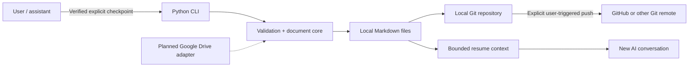
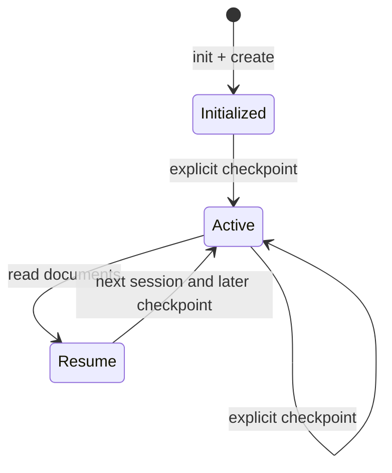

# Architecture

## Scope of this release

Current implementation: **local Markdown workspace + optional Git repository and Git remote transport**. GitHub works through ordinary Git credentials and remotes, not a dedicated REST API adapter. Google Drive is not implemented.

## Data model

Each project has a stable, lowercase/hyphenated slug and seven Markdown documents. `CURRENT_STATE.md` reserves an explicitly delimited managed block. Checkpoint edits only this block and appends to `SESSION_LOG.md`; optional dated entry goes to `DECISIONS.md`. Other manual notes remain. `PROJECTS_INDEX.md` lists project links.

Storage independence in v0.1 is achieved through plain files; a provider interface is a future refactor, not yet shipped. This matters because a future Google Drive implementation should not force a different document schema.

## State transition

## Consistency and safety

- A checkpoint validates inputs before writing. It uses atomic replacement for each file, but **not** an atomic multi-file transaction.
- The user may provide `--expected-state-sha256` to reject a stale `CURRENT_STATE.md` version. Without the precondition, a later checkpoint overwrites the managed state section (history remains appended).
- The Git layer refuses an already-staged unrelated index and stages only supplied managed paths; `sync` requires a clean working tree and tests remote commit ancestry before pushing. No force push.
- Basic regex checks for obvious secrets and symlink checks are defense-in-depth, not comprehensive guarantees.
- Trust boundary: the CLI cannot prove that the supplied status is factual; an assistant must label verified vs inferred details before calling it.

## Next architecture milestone

Introduce a minimal provider protocol (create/read/write/verify/history) and a tested Google Drive adapter using least-privilege OAuth scopes. Add concurrency policies, explicit conflict visualization and backup/rollback behavior. See [roadmap](roadmap.md).
